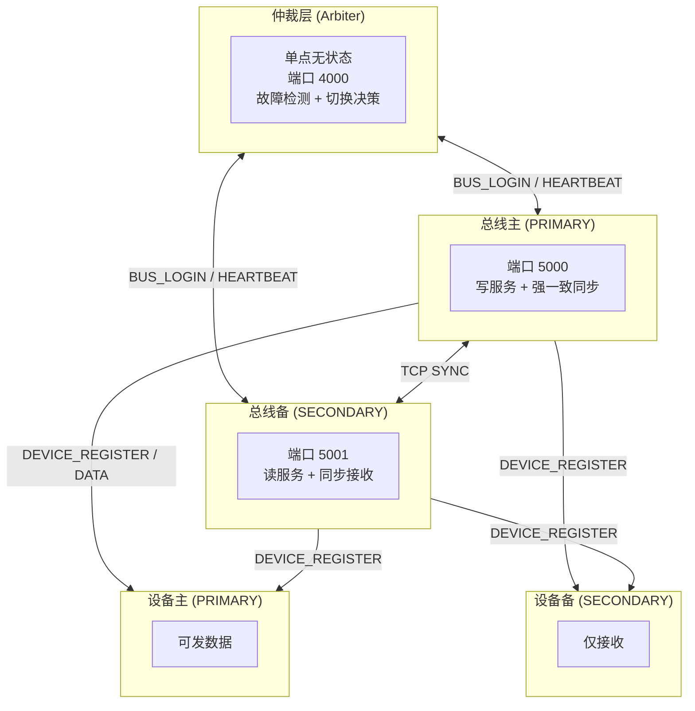
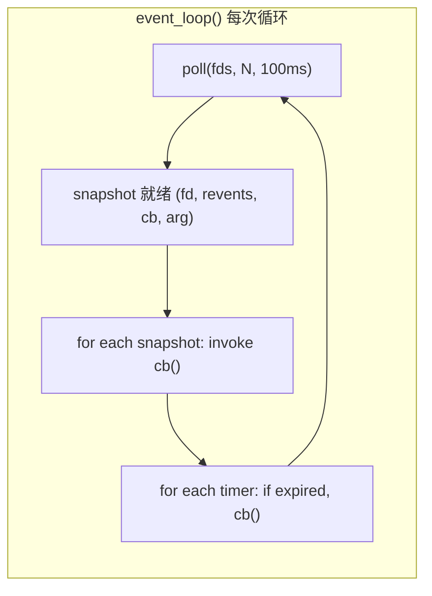
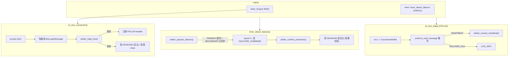
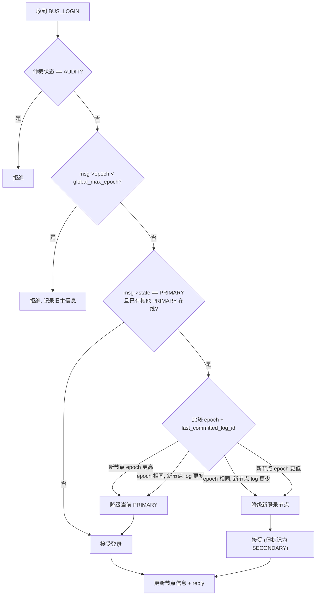
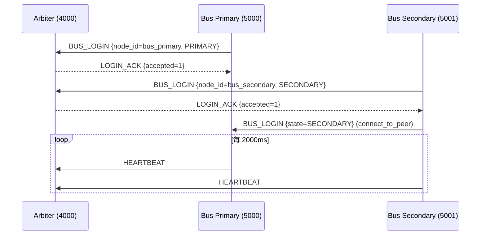
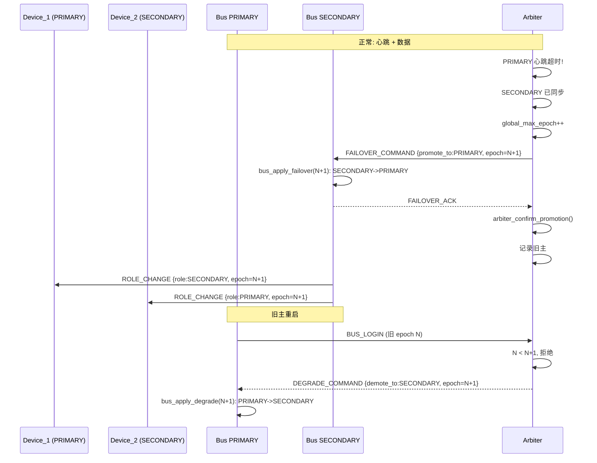
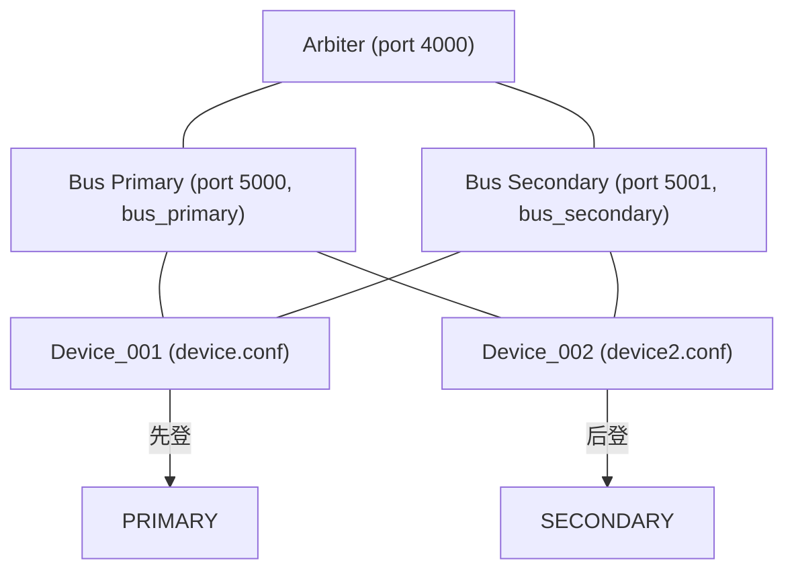

# HA 高可用系统设计文档

> 严格对应当前代码实现（2026-07-01），所有架构、协议、状态机、流程与实际源码一致。

---

## 1. 系统概述

三层架构: **仲裁层 (Arbiter) — 总线层 (Bus) — 设备层 (Device)**



### 1.1 设计原则

| 原则 | 说明 |
|------|------|
| 仲裁无状态 | Arbiter 不持久化数据, 重启后被动等待总线重新登录 |
| 总线状态机 | 每个总线节点独立运行状态机: INIT -> OFFLINE -> PRIMARY/SECONDARY |
| 主写备读强一致 | 主节点写操作必须同步到备节点并收到 ACK 后才返回成功 |
| 设备双连 | 每个设备同时连接主总线(5000)和备总线(5001) |
| 先登先主 | 首个注册到总线的设备为 PRIMARY, 后续为 SECONDARY |
| 总线断仲裁不降级 | 仲裁宕机时总线保持当前角色继续服务 |
| Epoch 防重放 | 单调递增 epoch 防止陈旧指令干扰 |

### 1.2 编译产物

| 二进制 | 编译标志 | 角色 |
|--------|----------|------|
| bin/arbiter | -- | 仲裁节点 |
| bin/bus_primary | -DIS_BUS_PRIMARY | 总线主节点 |
| bin/bus_secondary | -DIS_BUS_SECONDARY | 总线备节点 |
| bin/device | -- | 设备节点 |

---

## 2. 项目结构

```
HA/
  include/
    arbiter.h              # 仲裁接口
    bus.h                  # 总线接口 + 状态机
    device.h               # 设备接口
    common/
      protocol.h           # 全部消息结构体定义 (packed)
      network.h            # 事件循环, ConnectionBuffer, ProtocolReader
      logging.h            # 日志宏 (header-only, stderr + fflush)
      memory.h             # SAFE_FREE / safe_malloc
      config.h             # 配置加载 (key=value)
  src/
    arbiter/
      arbiter_main.c       # 网络层: 连接管理, 数据接收, failover 发送
      arbiter_logic.c      # 逻辑层: 登录校验, 心跳, 故障决策, epoch
    bus/
      bus_main.c           # 网络层: 仲裁/设备/主备peer, 数据面
      bus_state_machine.c  # 状态机: 状态转换, 消息幂等, 强一致同步
      bus_sync.c           # 同步协议: SYNC_ENTRY/ACK (备用接口)
    device/
      device_main.c        # 网络层: 双总线连接, 事件循环
      device_logic.c       # 逻辑层: 注册, 角色变更, 数据发送
    common/
      network.c            # 事件循环, ProtocolReader, 定时器, socket 工具
      protocol.c           # 全部消息的 hton/ntoh 转换
      config.c             # 配置文件解析
      memory.c             # safe_malloc / safe_strdup
  configs/
    arbiter.conf
    bus.conf               # 主总线 (node_id=bus_primary)
    bus_secondary.conf     # 备总线 (node_id=bus_secondary)
    device.conf            # 设备1 (device_id=device_001)
    device2.conf           # 设备2 (device_id=device_002)
  Makefile
  run_test.sh              # 全链路集成测试 (5 阶段, 19 断言)
  HA设计文档.md             # 本文档
```

---

## 3. 事件循环与网络层

### 3.1 单线程 Reactor 模型

所有进程均使用 `poll()` 驱动的单线程事件循环 (src/common/network.c:137-180).



关键特性:

- Handler snapshot: 回调执行前将所有就绪的 `(fd, revents, cb, arg)` 拷贝到独立数组, 避免回调中 `unregister_handler` 导致的数组错乱
- Timer 防漂移: `next_trigger += interval_ms` 而非 `now + interval_ms`, 保证定时器间隔不随时间累积偏移
- SIGPIPE 忽略: 所有进程执行 `signal(SIGPIPE, SIG_IGN)`, 防止 send 到关闭连接时进程被杀

### 3.2 ConnectionBuffer + ProtocolReader

解决 TCP 粘包/半包问题的两层抽象:

```
TCP 字节流:
+----------+----------+----------+----------+
|  header1 | payload1 | header2  | payload2  | ...
+----------+----------+----------+----------+

ConnectionBuffer (接收缓冲区):
+------------------------------------------------+
| read_buf (4096 bytes)                          |
| [  已接收数据        ][空闲空间                 ] |
|                     ^ read_buf_offset          |
+------------------------------------------------+

ProtocolReader 状态机:
  READ_STATE_HEADER  -> 读 sizeof(MessageHeader) 字节
                      -> 校验 length 合法性
                      -> 切换到 READ_STATE_PAYLOAD
  READ_STATE_PAYLOAD -> 读满 current_header.length 字节
                      -> 返回完整消息 -> 切回 HEADER
```

```c
int protocol_read_message(ProtocolReader *pr, uint8_t **out_msg, uint16_t *out_len);
// 返回:  1 = 完整消息就绪, *out_msg 由调用者 free
//        0 = 数据不足
//       -1 = 非法报文, 已跳过损坏头部
```

---

## 4. 消息协议

### 4.1 通用消息头

所有消息以 `MessageHeader` 开头, 网络字节序 (big-endian) 传输.

```c
#pragma pack(push, 1)
typedef struct {
    uint16_t type;      // MessageType 枚举
    uint16_t length;    // 整条消息长度 (含头)
    uint64_t timestamp; // 毫秒时间戳
} MessageHeader;
#pragma pack(pop)
```

### 4.2 全部消息类型

| 枚举值 | 名称 | 方向 | 说明 |
|--------|------|------|------|
| 1 | MSG_TYPE_BUS_LOGIN | Bus<->Arbiter / Bus<->Bus | 总线登录仲裁 / 主备互相登录 |
| 2 | MSG_TYPE_HEARTBEAT | Bus->Arbiter | 总线心跳 (含 epoch) |
| 3 | MSG_TYPE_FAILOVER_COMMAND | Arbiter->Bus | 切换指令 (含新 epoch) |
| 4 | MSG_TYPE_FAILOVER_ACK | Bus->Arbiter | 切换确认 |
| 5 | MSG_TYPE_DEVICE_REGISTER | Device->Bus | 设备注册 |
| 6 | MSG_TYPE_DEVICE_ROLE_ASSIGN | Bus->Device | 角色分配 (含 epoch) |
| 7 | MSG_TYPE_ROLE_CHANGE | Bus->Device | 角色变更 (含 epoch) |
| 8 | MSG_TYPE_DEVICE_DATA_PACKET | Device->Bus | 设备数据写入 |
| 9 | MSG_TYPE_BUS_SYNC_ENTRY | Bus(主)->Bus(备) | 同步日志条目 |
| 10 | MSG_TYPE_BUS_ACK | Bus(备)->Bus(主) | 同步确认 |
| 11 | MSG_TYPE_LOGIN_ACK | Arbiter->Bus | 登录应答 |
| 12 | MSG_TYPE_HEARTBEAT_ACK | (已定义未使用) | -- |
| 13 | MSG_TYPE_WRITE_RESPONSE | Bus->Device | 写应答 |
| 14 | MSG_TYPE_CHECK_SYNC_STATUS | (已定义未使用) | -- |
| 15 | MSG_TYPE_SYNC_OK | (已定义未使用) | -- |
| 16 | MSG_TYPE_DEGRADE_COMMAND | Arbiter->Bus | 降级指令 (旧主重连时) |
| 17 | MSG_TYPE_SYNC_REQUEST | (已定义未使用) | -- |

### 4.3 关键消息结构体

```c
// BUS_LOGIN (总线和仲裁之间)
typedef struct {
    MessageHeader header;
    char node_id[NODE_ID_MAX_LEN];   // 32 bytes
    uint8_t state;                   // BusState
    uint8_t role;                    // NodeRole
    uint32_t epoch;                  // 纪元号
    uint64_t last_committed_log_id;
} BusLoginMessage;

// FAILOVER_COMMAND (仲裁->总线)
typedef struct {
    MessageHeader header;
    char target_node_id[NODE_ID_MAX_LEN];
    uint8_t promote_to;
    uint32_t epoch;
} FailoverCommandMessage;

// DEGRADE_COMMAND (仲裁->旧主总线)
typedef struct {
    MessageHeader header;
    char target_node_id[NODE_ID_MAX_LEN];
    uint8_t demote_to;
    uint32_t epoch;
} DegradeCommandMessage;

// LOGIN_ACK (仲裁->总线)
typedef struct {
    MessageHeader header;
    uint8_t accepted;
    uint8_t assigned_role;
    uint32_t epoch;
} LoginAckMessage;

// DEVICE_REGISTER (设备->总线)
typedef struct {
    MessageHeader header;
    char device_id[DEVICE_ID_MAX_LEN];
} DeviceRegisterMessage;

// DEVICE_ROLE_ASSIGN (总线->设备)
typedef struct {
    MessageHeader header;
    char device_id[DEVICE_ID_MAX_LEN];
    uint8_t role;
    uint32_t epoch;
} DeviceRoleAssignMessage;

// ROLE_CHANGE (总线->设备)
typedef struct {
    MessageHeader header;
    char device_id[DEVICE_ID_MAX_LEN];
    uint8_t role;
    uint32_t epoch;
} RoleChangeMessage;

// DEVICE_DATA_PACKET (设备->总线)
typedef struct {
    MessageHeader header;
    char device_id[DEVICE_ID_MAX_LEN];
    uint64_t message_id;
    uint32_t payload_size;
    uint8_t payload[PAYLOAD_MAX_LEN];
} DeviceDataPacketMessage;

// BUS_SYNC_ENTRY (主总线->备总线)
typedef struct {
    MessageHeader header;
    uint64_t log_id;
    uint32_t payload_size;
    uint8_t payload[PAYLOAD_MAX_LEN];
} BusSyncEntryMessage;

// BUS_ACK (备总线->主总线)
typedef struct {
    MessageHeader header;
    uint64_t log_id;
    uint8_t status;
} BusAckMessage;

// WRITE_RESPONSE (总线->设备)
typedef struct {
    MessageHeader header;
    uint64_t message_id;
    uint8_t success;
} WriteResponseMessage;
```

### 4.4 字节序转换

所有多字节字段在发送前调用 `protocol_hton_*()` 转为网络字节序, 接收后调用 `protocol_ntoh_*()` 转回主机序.

```c
void protocol_hton_bus_login(BusLoginMessage *msg) {
    protocol_hton_header(&msg->header);   // type, length, timestamp
    msg->epoch = htonl(msg->epoch);
    msg->last_committed_log_id = c11_htobe64(msg->last_committed_log_id);
}
// node_id, state, role 为单字节/字符串, 不转换
```

uint64_t 用纯 C11 实现:
```c
uint64_t c11_htobe64(uint64_t val) {
    uint32_t lo = htonl((uint32_t)val);
    uint32_t hi = htonl((uint32_t)(val >> 32));
    return ((uint64_t)lo << 32) | hi;
}
```

---

## 5. 总线状态机

### 5.1 状态定义

```c
typedef enum {
    NODE_STATE_INIT = 0,    // 初始化中
    NODE_STATE_OFFLINE,     // 未连接仲裁
    NODE_STATE_SOLO,        // 单点模式 (无仲裁时)
    NODE_STATE_PRIMARY,     // 主节点
    NODE_STATE_SECONDARY,   // 备节点
} BusState;
```

### 5.2 状态转换图

```mermaid
stateDiagram-v2
    [*] --> INIT
    INIT --> OFFLINE: 初始化完成
    OFFLINE --> PRIMARY: 仲裁分配
    OFFLINE --> SECONDARY: 仲裁分配
    OFFLINE --> SOLO: 仲裁不可用
    SOLO --> PRIMARY: 仲裁分配
    SOLO --> SECONDARY: 仲裁分配
    PRIMARY --> SECONDARY: FAILOVER_COMMAND / DEGRADE_COMMAND
    SECONDARY --> PRIMARY: FAILOVER_COMMAND
    PRIMARY --> OFFLINE: (代码已定义但未使用)
    SECONDARY --> OFFLINE: (代码已定义但未使用)
    note right of PRIMARY: 仲裁断开: 保持当前角色
    note right of SECONDARY: 仲裁断开: 保持当前角色
```

### 5.3 核心状态机代码 (src/bus/bus_state_machine.c)

```c
typedef struct {
    BusState state;
    uint32_t epoch;
    uint64_t last_committed_log_id;
    uint64_t current_log_id;
    bool is_switching;
} BusNode;

static BusNode self_node;

void bus_apply_failover(uint32_t new_epoch) {
    self_node.epoch = new_epoch;
    if (self_node.state == NODE_STATE_SECONDARY) {
        transition_to(&self_node, NODE_STATE_PRIMARY);
    } else if (self_node.state == NODE_STATE_PRIMARY) {
        transition_to(&self_node, NODE_STATE_SECONDARY);
    }
}

void bus_apply_degrade(uint32_t new_epoch) {
    self_node.epoch = new_epoch;
    if (self_node.state == NODE_STATE_PRIMARY) {
        self_node.is_switching = true;
        transition_to(&self_node, NODE_STATE_SECONDARY);
        self_node.is_switching = false;
    }
}

void on_arbiter_disconnect(void) {
    if (state == PRIMARY || state == SECONDARY || state == SOLO) {
        // 保持当前角色继续服务
    } else {
        transition_to(&self_node, OFFLINE);
    }
}
```

---

## 6. 仲裁层 (Arbiter) 详细设计

### 6.1 总体流程

Arbiter 源码: src/arbiter/arbiter_main.c + arbiter_logic.c



### 6.2 登录校验逻辑 (arbiter_logic.c:arbiter_login_bus)



### 6.3 故障检测

```
timer_detect_failures() (每秒执行)
  |
  v
arbiter_prepare_failover()
  |  查找 PRIMARY 节点
  |  now - last_heartbeat > heartbeat_timeout_ms (默认 5000)?
  |     YES -> is_secondary_synced()?
  |               YES -> global_max_epoch++
  |                      return (sec->node_id, new_epoch)
  |               NO  -> LOG_WARN("secondary not synced")
  |     NO  -> return false (无操作)
  |
  v (如返回 target_id)
发送 FAILOVER_COMMAND (阻塞 send 确保到达内核)
  -> arbiter_confirm_promotion()
      -> sec->state = PRIMARY, pri->state = SECONDARY
      -> 记录旧主信息
  -> 如果旧主在线: 发送 DEGRADE_COMMAND
```

### 6.4 心跳处理

- 总线每 2000ms 发送 `HeartbeatMessage {node_id, epoch}`
- 仲裁仅更新 `node->last_heartbeat = current_time_ms()`, 不回复 ACK
- 心跳 epoch 比本地大则更新本地 epoch, 比本地小则 LOG_WARN

### 6.5 仲裁数据结构

```c
#define MAX_BUS_NODES 2

static ArbiterNodeInfo nodes[MAX_BUS_NODES];
static int node_count = 0;
static uint32_t global_max_epoch = 0;
static int64_t heartbeat_timeout_ms = 5000;
static char old_primary_id[NODE_ID_MAX_LEN];
static bool has_old_primary = false;

typedef struct {
    char node_id[NODE_ID_MAX_LEN];
    BusState state;
    NodeRole role;
    uint32_t epoch;
    uint64_t last_heartbeat;
    uint64_t last_committed_log_id;
} ArbiterNodeInfo;
```

---

## 7. 总线层 (Bus) 详细设计

### 7.1 双总线启动流程



### 7.2 Bus 主进程 (bus_primary)

**连接拓扑:**

```
bus_primary 进程
  +-- arbiter_fd -> Arbiter (4000): POLLIN (on_arbiter_data)
  +-- listen_fd -> port 5000: POLLIN (on_new_connection)
  |     +-- 设备1 client_fd: POLLIN (on_device_data)
  |     +-- 设备2 client_fd: POLLIN (on_device_data)
  |     +-- 备总线 client_fd: (peer_fd, 无 POLLIN handler)
  +-- 定时器
        +-- heartbeat_timer: send_heartbeat_to_arbiter (2000ms)
        +-- reconnect_timer: try_reconnect_arbiter (3000ms, 按需)
```

**on_arbiter_data (收到仲裁消息):**

收到 FAILOVER_COMMAND:
1. 回复 FAILOVER_ACK
2. bus_apply_failover(cmd->epoch) -> 翻转状态
3. 如果新状态为 PRIMARY:
   - 遍历所有设备, 将 ROLE_PRIMARY 的设备降级为 SECONDARY
   - 将最后一个注册的设备提升为 PRIMARY
4. 如果新状态为 SECONDARY: close_peer_connection()

收到 DEGRADE_COMMAND:
1. bus_apply_degrade(cmd->epoch) -> PRIMARY->SECONDARY

**on_new_connection (收到新连接):**

```c
// 读 MessageHeader -> 判断 type
if (type == MSG_TYPE_BUS_LOGIN) {
    // 校验 state == NODE_STATE_SECONDARY, 否则拒绝
    peer_fd = client_fd;
} else if (type == MSG_TYPE_DEVICE_REGISTER) {
    // bus_register_device(): 先登为 PRIMARY, 后登为 SECONDARY
    // 注册 POLLIN handler -> on_device_data
}
```

**process_device_packet (强一致同步):**

```mermaid
flowchart TD
    REQ["设备写入请求"] --> DEDUP{"has_processed_message()?"}
    DEDUP -->|是| CACHE["返回缓存结果 (幂等)"]
    DEDUP -->|否| ROLE{"state == PRIMARY 或 SOLO?"}
    ROLE -->|否| FAIL["返回失败"]
    ROLE -->|是| LOG["append_local_log() -> 分配 log_id"]
    LOG --> SYNC{"peer_fd >= 0?"}
    SYNC -->|是| SEND["send SYNC_ENTRY 给备总线"]
    SEND --> WAIT["poll 等待 ACK (最多 5x200ms=1s)"]
    WAIT -->|ACK OK| COMMIT["commit_log(), 缓存成功"]
    WAIT -->|无 ACK| CACHE_FAIL["缓存失败"]
    SYNC -->|否 (SOLO)| COMMIT
    COMMIT --> RESP["回复 WriteResponseMessage {success=1}"]
    CACHE_FAIL --> RESP_F["回复 WriteResponseMessage {success=0}"]
    CACHE --> RESP_CACHE["回复缓存结果"]
```

### 7.3 Bus 备进程 (bus_secondary)

**连接拓扑:**

```
bus_secondary 进程
  +-- arbiter_fd -> Arbiter (4000): POLLIN (on_arbiter_data)
  +-- listen_fd -> port 5001: POLLIN (on_new_connection)
  |     +-- 设备1 client_fd: POLLIN (on_device_data)
  |     +-- 设备2 client_fd: POLLIN (on_device_data)
  +-- peer_fd -> bus_primary (5000): (connect_to_peer)
  +-- 定时器
        +-- heartbeat_timer (2000ms)
        +-- reconnect_timer (3000ms, 按需)
        +-- peer_poll_timer (50ms, poll_peer_messages)
```

**connect_to_peer:**

仅在备总线执行 ( `#ifndef IS_BUS_PRIMARY` ):
```
创建阻塞 socket -> connect(主总线:5000)
发送 BUS_LOGIN {state=SECONDARY, role=SECONDARY}
创建 ConnectionBuffer + ProtocolReader
注册 peer_poll_timer (50ms 轮询)
```

**poll_peer_messages:**

```
if (state == SECONDARY) {
    recv(peer_fd, temp_buf, MSG_DONTWAIT)
    -> ConnectionBuffer -> protocol_read_message
    -> type == MSG_TYPE_BUS_SYNC_ENTRY:
         bus_apply_sync_entry(log_id, payload, payload_size)
           -> 更新 last_committed_log_id
         send BUS_ACK {status=1}
}
```

### 7.4 消息幂等

```c
#define MAX_MSG_CACHE 1024

typedef struct {
    char device_id[DEVICE_ID_MAX_LEN];
    uint64_t message_id;
    uint8_t status;
    bool valid;
} CachedResponse;

static CachedResponse cached_responses[MAX_MSG_CACHE];
static int cache_next = 0;  // 循环写指针

// 查找: 线性扫描 valid==true 的条目, 匹配 device_id + message_id
// 写入: cache_next = (cache_next + 1) % MAX_MSG_CACHE
```

---

## 8. 设备层 (Device) 详细设计

### 8.1 设备双连接

```c
// device_main.c
pri_link.fd = connect_and_register(bus_primary_host, 5000, device_id);
sec_link.fd = connect_and_register(bus_secondary_host, 5001, device_id);

// 两个连接都注册 POLLIN handler -> on_bus_role_change
register_handler(pri_link.fd, POLLIN, on_bus_role_change, &pri_link);
register_handler(sec_link.fd, POLLIN, on_bus_role_change, &sec_link);

event_loop();
```

### 8.2 注册与角色分配

```
Device -> Bus: DEVICE_REGISTER {device_id}
Bus -> Device: DEVICE_ROLE_ASSIGN {device_id, role, epoch}

Device 逻辑 (device_send_register):
  1. protocol_hton_device_reg, send(fd)
  2. recv reply, protocol_ntoh_device_role_assign
  3. if reply.epoch >= last_accepted_epoch:
       last_accepted_epoch = reply.epoch
       current_role = reply.role
       return true
     else: 丢弃 (陈旧分配)
```

### 8.3 Epoch 验证

```c
bool device_receive_role_change(int bus_fd, RoleChangeMessage *msg) {
    if (msg->epoch >= dev_ctx.last_accepted_epoch) {
        dev_ctx.last_accepted_epoch = msg->epoch;
        dev_ctx.current_role = msg->role;
        return true;
    }
    return false;  // 丢弃陈旧指令
}
```

### 8.4 on_bus_role_change (接收总线消息)

```c
void on_bus_role_change(int fd, short revents, void *arg) {
    if (revents & (POLLERR | POLLHUP)) {
        // 断开连接, 注销 handler, 销毁 link
        return;
    }
    if (revents & POLLIN) {
        recv -> ConnectionBuffer -> protocol_read_message 循环
        -> type == MSG_TYPE_ROLE_CHANGE:
             device_receive_role_change()
        -> 其他: LOG_WARN
    }
}
```

---

## 9. Failover 完整流程

### 9.1 序列图



### 9.2 防脑裂机制

| 机制 | 说明 |
|------|------|
| Epoch 递增 | 每次 failover 仲裁递增 epoch, 旧 epoch 节点被拒绝登录 |
| 设备降级 | 新 PRIMARY 先降级所有设备为 SECONDARY, 再提升一个 |
| 主备冲突 | 仲裁比较 epoch 和 log_id 决定降级谁 |
| DEGRADE 指令 | 旧主重连时强制降级 |

### 9.3 时间线

```
T=0:   Arbiter 启动, Bus_Pri 启动, Bus_Sec 启动
T=1:   Bus_Pri 登录 Arbiter (epoch=0, PRIMARY)
T=2:   Bus_Sec 登录 Arbiter (epoch=0, SECONDARY)
T=3:   Bus_Sec -> Bus_Pri: BUS_LOGIN (SECONDARY) -> peer 建立
T=4:   Device_1 注册到 Bus_Pri (PRIMARY)
T=5:   Device_1 注册到 Bus_Sec
T=6:   Device_2 注册到 Bus_Pri (SECONDARY)
T=7:   Device_2 注册到 Bus_Sec

T=10:  Bus_Pri 被 kill
T=11:  Arbiter 检测超时 (5s)
T=12:  Arbiter 发 FAILOVER_COMMAND 给 Bus_Sec (epoch=1)
T=13:  Bus_Sec 切换为 PRIMARY
T=14:  Bus_Sec 降级 Dev1, 提升 Dev2
T=15:  Bus_Pri 重启 (epoch=0) -> Arbiter 拒绝, 发 DEGRADE
T=16:  Bus_Pri 降级为 SECONDARY, 连接到新主

T=20:  Arbiter 被 kill -> Bus 保持角色
T=25:  Arbiter 重启 -> Bus 重新登录
```

---

## 10. 配置系统

### 10.1 配置文件

键值对文本, `#` 注释, `key=value` 格式.

configs/arbiter.conf:
```
listen_port=4000
heartbeat_timeout_ms=5000
```

configs/bus.conf (主总线):
```
node_id=bus_primary
listen_port=5000
arbiter_host=127.0.0.1
arbiter_port=4000
heartbeat_interval_ms=2000
```

configs/bus_secondary.conf (备总线):
```
node_id=bus_secondary
listen_port=5001
arbiter_host=127.0.0.1
arbiter_port=4000
bus_primary_host=127.0.0.1
bus_primary_port=5000
heartbeat_interval_ms=2000
```

configs/device.conf (设备1):
```
device_id=device_001
bus_primary_host=127.0.0.1
bus_primary_port=5000
bus_secondary_host=127.0.0.1
bus_secondary_port=5001
```

configs/device2.conf (设备2):
```
device_id=device_002
bus_primary_host=127.0.0.1
bus_primary_port=5000
bus_secondary_host=127.0.0.1
bus_secondary_port=5001
```

### 10.2 解析器

```c
// config_load(cfg, filename): 逐行读取, 按 '=' 分割
// 跳过空行和 # 开头行
// 过滤 key/value 空白字符
// config_get(cfg, key): 线性查找 O(n)
// config_get_int(cfg, key, default): atoi 包装
```

---

## 11. 错误处理与日志

### 11.1 日志级别

| 宏 | 说明 |
|----|------|
| LOG_DEBUG | 调试 (CURRENT_LOG_LEVEL=0) |
| LOG_INFO | 一般信息 |
| LOG_WARN | 警告 (含缓冲区溢出提示) |
| LOG_ERROR | 错误 |
| LOG_FATAL | 致命错误 (输出后 exit(1)) |

格式: `[2026-07-01 12:34:56.789] [file.c:42] [LOG_LEVEL] message`

所有日志输出到 stderr, 每条日志后 `fflush(stderr)`.

### 11.2 错误码

```c
typedef enum {
    ERR_SUCCESS = 0,
    ERR_GENERIC = -1,
    ERR_TIMEOUT = -2,
    ERR_NETWORK = -3,
    ERR_INVALID_MSG = -4,
    ERR_EPOCH_MISMATCH = -5,
    ERR_NOT_PRIMARY = -6,
    ERR_ALREADY_PROCESSED = -7,
} ErrorCode;
```

### 11.3 关键错误场景

| 场景 | 处理方式 |
|------|---------|
| 缓冲区满 | LOG_WARN("dropping %zu bytes") 截断 |
| 非法消息头 | protocol_read_message 跳过损坏部分, 返回 -1 |
| 非阻塞 recv EAGAIN | 直接 return, 等待下次 POLLIN |
| POLLHUP/POLLERR | 清理连接, 注销 handler |
| send 失败 (非 EAGAIN) | 触发连接清理/重连 |
| 旧 epoch 登录 | 拒绝, 发 DEGRADE_COMMAND |
| 双主冲突 | 按 epoch + log_id 降级 |

---

## 12. 集成测试

### 12.1 测试框架 (run_test.sh)

纯 bash 脚本, 19 断言, 5 阶段:

```
阶段零: 启动 Arbiter + Bus_Pri + Bus_Sec
阶段一: 启动 Device_1 (PRIMARY) + Device_2 (SECONDARY)
阶段二: 主总线故障 -> Failover -> 旧主重连 + DEGRADE
阶段三: Arbiter 重启 -> 总线自动重连
阶段四: Device_1 重启 -> 重新分配为 SECONDARY
阶段五: 全系统重启 -> 完整恢复
```

### 12.2 验证方法

- wait_for_log(log_file, pattern, timeout) 轮询日志 grep 匹配
- assert_test(name, result) 输出 PASS/FAIL
- 日志重定向到 test_logs/*.log
- cleanup trap 保证退出时杀进程

### 12.3 测试拓扑



---

## 13. 编译与运行

### 13.1 Makefile

```makefile
CC = clang-7
CFLAGS = -std=c11 -Wall -Wextra -Werror -g -O2
INCLUDES = -Iinclude

bin/arbiter:       src/common/*.c src/arbiter/*.c
bin/bus_primary:   src/common/*.c src/bus/*.c    (CFLAGS += -DIS_BUS_PRIMARY)
bin/bus_secondary: src/common/*.c src/bus/*.c    (CFLAGS += -DIS_BUS_SECONDARY)
bin/device:        src/common/*.c src/device/*.c
```

### 13.2 运行方式

```bash
make                  # 编译全部
make run_arbiter      # 启动仲裁 (port 4000)
make run_bus_primary  # 启动主总线 (port 5000)
make run_bus_secondary# 启动备总线 (port 5001)
make run_device       # 启动设备1
make run_device2      # 启动设备2
make test             # 运行全部集成测试
```

### 13.3 端口分配

| 进程 | 端口 | 用途 |
|------|------|------|
| Arbiter | 4000 | 仲裁监听 |
| Bus Primary | 5000 | 主总线监听 (设备 + 备总线) |
| Bus Secondary | 5001 | 备总线监听 (设备) |

---

## 14. 关键设计决策

| 决策 | 理由 | 代码位置 |
|------|------|---------|
| poll() 而非 epoll | 跨平台, 节点少时性能足够 | network.c:137 |
| Handler 快照 | 防止修改 handlers 数组导致跳过/重复 | network.c:151-168 |
| Timer next += interval | 避免漂移累积 | network.c:174-176 |
| SO_REUSEADDR | 快速重启时端口复用 | network.c:88 |
| 阻塞 send 发 FAILOVER | 确保关键指令到达内核缓冲区 | arbiter_main.c:179-185 |
| 阻塞 connect peer/device | 避免 EINPROGRESS 复杂性 | bus_main.c:300, device_main.c:51 |
| 环形缓冲区消息幂等 | 固定大小无泄漏, O(n) 扫描 1024 条目可接受 | bus_state_machine.c:50-86 |
| 备总线 poll 轮询 peer | 50ms 定时器, 简化事件管理 | bus_main.c:331-376 |
| #ifndef IS_BUS_PRIMARY | 主备共用 bus_main.c, 条件编译 | bus_main.c:27-40 |
| SIGPIPE 忽略 | 防止写关闭连接时进程被杀 | 三个 main() |
| 降级优先于升级 | 先 demote ALL, 再 promote ONE | bus_main.c:238-268 |

---

## 15. 演进方向

- 仲裁多副本: 当前单点, 可扩展 Raft 集群
- 业务数据面测试: 当前仅验证控制面, 可增加 device_send_data 写数据验证
- 备总线读服务: 当前备总线可实现读接口
- 全量同步: bus_request_full_sync / SyncRequestMessage 已定义未实现
- 指数退避重连: ReconnectContext / try_connect 已实现未在 main 中使用
- 配置文件校验: 当前用默认值兜底, 未做集成校验
- 心跳 ACK: MSG_TYPE_HEARTBEAT_ACK 已定义未使用

---

*文档版本: v1.0 | 对应代码日期: 2026-07-01 | 全部 19 测试通过*
