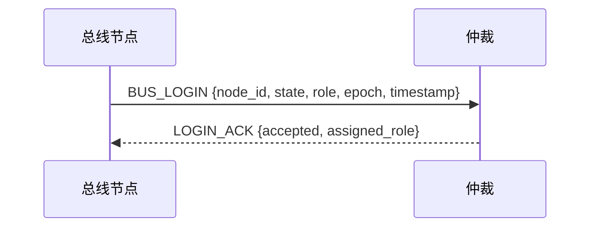
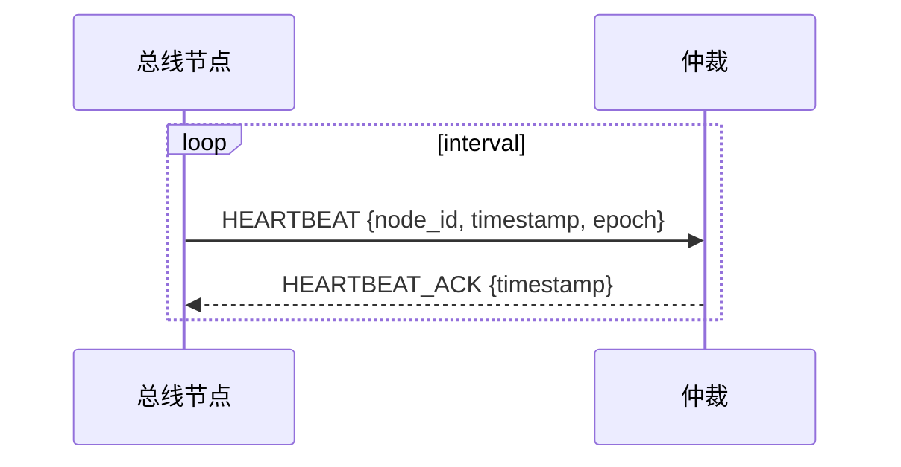
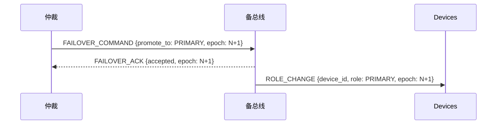
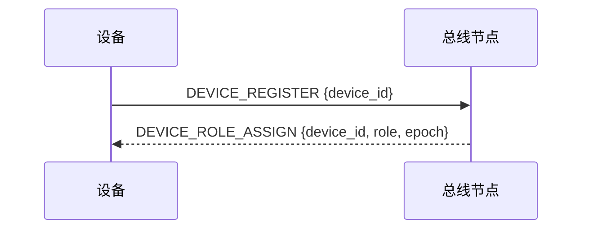
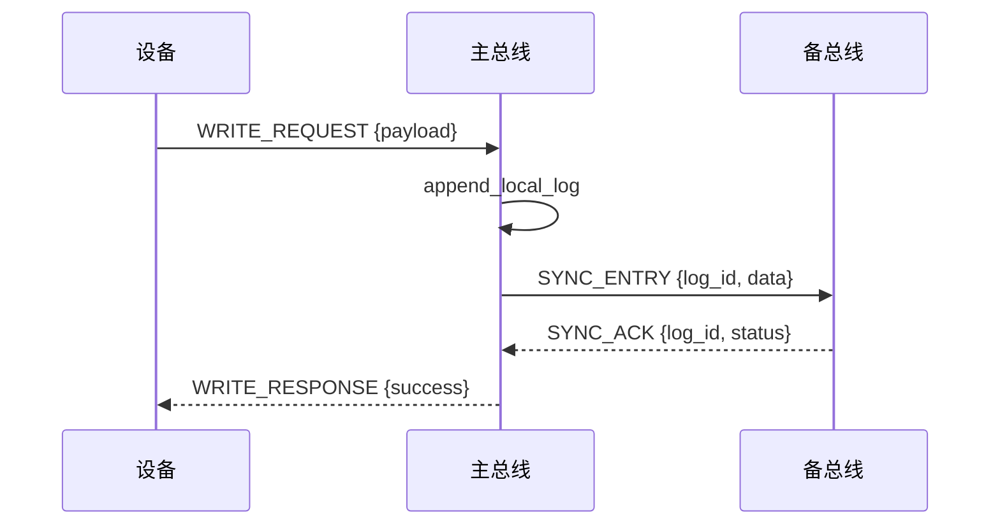
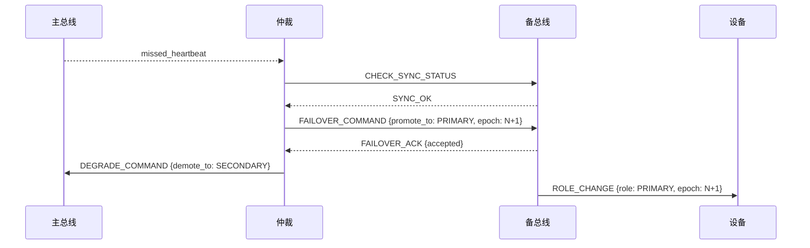
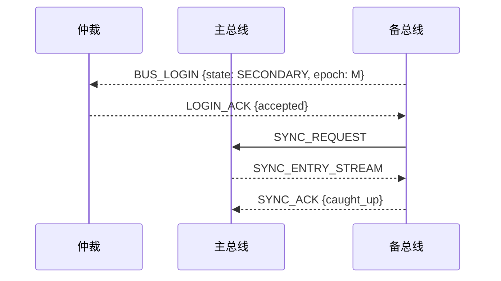
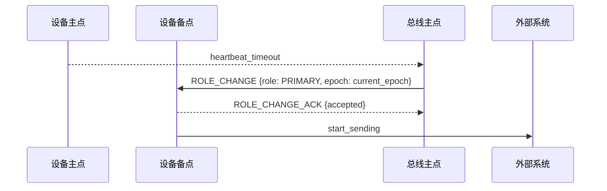

# HA 原型设计文档

## 1. 目标与范围

本设计文档描述一个用于高可用系统的 HA 原型架构。

该系统由三层组成：
- 仲裁层（Arbiter）
- 总线层（Bus）
- 设备层（Device）

目标是提供一个可行的架构设计，包含状态机、通信协议、故障处理、主备切换、数据一致性和设备注册流程。文档同时以 AI 友好的方式表达，便于后续将其自动翻译成代码实现。

## 2. 总体架构

### 2.1 结构概览

系统分为三层：
- 仲裁层：单点，负责监控总线、判定主备、协调切换。
- 总线层：一主一备强一致性模型，主写备读，主备之间通过 TCP 同步数据。
- 设备层：一主多备，每个设备节点同时连接总线主点与备点，角色由总线分配。

### 2.2 设计原则

- 仲裁层无状态
- 总线节点作为状态机存在
- 总线主动登录仲裁
- 仲裁恢复后被动等待总线登录
- 总线断开仲裁时保持当前角色
- 设备主备身份由总线分配
- 设备主备不直接通信
- 设备主备同时连接主备总线

## 3. 角色与组件

### 3.1 仲裁层（Arbiter）

职责：
- 接收总线节点登录
- 监控总线主备节点心跳
- 判定总线故障
- 发布总线主备切换指令（仅在必要时）

特点：
- 单点设计
- 无持久状态
- 仅保留当前连接信息、最后心跳时间、节点状态

### 3.2 总线层（Bus）

职责：
- 维护一主一备强一致性
- 负责总线数据同步与提交确认
- 接受设备注册与主备分配
- 接收仲裁指令并执行切换

特点：
- 具有状态机
- 主备之间通过 TCP 连接同步
- 仅主节点对外提供写服务
- 备节点可对外提供读服务，但只读取已提交数据

### 3.3 设备层（Device）

职责：
- 注册到总线
- 维护与总线主点/备点的连接
- 根据角色执行发包或仅收包
- 接收总线下发的角色变更或仲裁指令

特点：
- 每个设备同时连接两个总线节点
- 先登录先主原则（暂定）
- 主点允许发包，备点仅接收

## 4. 总线状态机

### 4.1 状态定义

总线节点状态机包含以下状态：
- `INIT`：启动中，尚未完成初始化
- `OFFLINE`：离线状态，未连接仲裁或不参与服务
- `SOLO`：单点模式，当前节点独自工作
- `PRIMARY`：主节点
- `SECONDARY`：备节点

### 4.2 状态转换

- `INIT` -> `OFFLINE`：初始化完成但未连接仲裁
- `OFFLINE` -> `SOLO`：仲裁不可用或单节点启动场景
- `OFFLINE` -> `PRIMARY`：被仲裁选为主节点
- `OFFLINE` -> `SECONDARY`：被仲裁选为备节点
- `PRIMARY` -> `SECONDARY`：主节点接受仲裁切换指令后降级
- `SECONDARY` -> `PRIMARY`：备节点接受仲裁切换指令后升级
- `*` -> `OFFLINE`：失去仲裁连接且判定无法继续服务时

### 4.3 状态机伪代码

```c
typedef struct {
    BusState state;
    int heartbeat_miss_count;
    uint32_t epoch;
} BusNode;

void transition_to(BusNode *node, BusState target_state) {
    node->state = target_state;
}

void on_arbiter_disconnect(BusNode *node) {
    if (node->state == NODE_STATE_PRIMARY || node->state == NODE_STATE_SECONDARY || node->state == NODE_STATE_SOLO) {
        keep_current_role(node);
    } else {
        transition_to(node, NODE_STATE_OFFLINE);
    }
}
```

## 5. 仲裁协议

### 5.1 登录流程

总线节点在启动后必须登录仲裁。登录消息使用 `BusLoginMessage` 二进制结构，包含：
- `node_id`
- `state`
- `role`
- `epoch`
- `timestamp`
- `last_committed_log_id`

该消息具体字段定义见第 10 章中的 `BusLoginMessage`。

### 5.2 心跳协议

心跳消息使用 `HeartbeatMessage` 二进制结构，主要包含：
- `node_id`
- `timestamp`
- `epoch`

该消息用于检测总线节点是否存活。

### 5.3 仲裁逻辑

仲裁行为遵循：
- 只保留当前连接信息和最新状态
- 不存储历史主备决定
- 一旦接收到总线登录信息，更新该节点的当前状态
- 仅在必要时发布切换指令
- 仲裁恢复后不主动查询总线，由总线主动重新登录

### 5.4 仲裁决策规则

- 若 `PRIMARY` 节点心跳超时，并且 `SECONDARY` 已同步最新数据，则发布切换指令
- 若 `SECONDARY` 心跳超时，则保留 `PRIMARY` 不变，等待 `SECONDARY` 恢复
- 若仲裁自身重启，等待总线重新登录，更新状态后再做判断

### 5.5 仲裁重启与登录校验

仲裁重启后必须执行严格校验：
- 等待所有总线节点重新登录
- 对比 `epoch`、`last_committed_log_id`、`state`、`role`
- 若不同节点报告冲突角色或日志位置，仲裁应拒绝直接切换并进入"手动/审计"状态
- 只有在 `SECONDARY` 证明已追上 `PRIMARY` 的最后提交日志后，才允许发布 `FAILOVER_COMMAND`
- 若 `epoch` 发生变化，仲裁应确认当前 `PRIMARY` 是否仍为最新 leader，并更新 `epoch` 以避免旧主复活

仲裁登录校验不仅依赖心跳，还要依赖 `BusLoginMessage` 中上报的当前已提交记录位置。对于相同 `epoch` 的多个登录节点，仲裁应优先保留那个 `last_committed_log_id` 更大的节点作为 `PRIMARY`。

### 5.6 Epoch 设计

为了避免在总线节点网络抖动、脑裂或仲裁恢复后发出过时的切换指令，系统引入单调递增的 `epoch`（纪元）字段。

- `epoch` 由仲裁层在每次决定发起 `FAILOVER_COMMAND` 时递增，并随指令发送给总线节点。
- 总线节点在收到 `FAILOVER_COMMAND` 后，立即更新自己的本地 `epoch`，并在后续所有下发给设备的控制指令（如 `ROLE_CHANGE`、`DEVICE_ROLE_ASSIGN`、心跳）中携带该 `epoch`。
- 设备端维护一个 `last_accepted_epoch`，只接受 `epoch >= last_accepted_epoch` 的指令，并丢弃 `epoch` 过小或重复的指令。
- 仲裁重启后，总线重新登录时上报自己的 `epoch`。仲裁仅接受 `epoch` 大于或等于当前已知最大 `epoch` 的登录节点，从而拒绝旧主复活。

## 6. 总线主备同步协议

### 6.1 主写备读语义

- 写请求必须在主节点和备节点都确认后才对上游返回成功。
- 备节点读取的数据必须是已提交并确认同步的数据。
- 备节点可以对外提供读服务，但不得读取尚未提交的数据。

### 6.2 同步流程

1. 设备发起写请求到主总线。
2. 主总线写入本地日志，并分配连续 `log_id`。
3. 主总线通过 TCP 将日志条目发送给备总线，并标记为"待提交"。
4. 备总线确认收到并应用到本地状态，更新 `last_committed_log_id`。
5. 备总线回复确认。
6. 主总线收到确认后，再将该写请求标记为"已提交"，然后对设备返回成功。

主备同步必须采用同步提交机制，主节点不得在未收到备节点确认前对外返回写成功。

```c
void handle_write_request(const DeviceDataPacketMessage *req) {
    uint64_t log_id = append_local_log(req->payload, req->payload_size);
    send_sync_entry(secondary_fd, log_id, req->payload, req->payload_size);
    BusAckMessage ack;
    if (wait_for_sync_ack(&ack) && ack.status == 1) {
        commit_log(log_id);
        send_write_response(req->message_id, true);
    } else {
        send_write_response(req->message_id, false);
    }
}
```

### 6.3 TCP 协议要求

主备之间的 TCP 通信至少应包含：
- 序列号 / 事务 ID
- 操作类型（WRITE, SYNC, COMMIT 等）
- 心跳保持机制
- 确认 ACK

### 6.4 主备一致性保证

- 备节点的最终确认点必须等于或超过主节点已提交的日志位置。
- 在角色切换前，备节点必须达到主节点最后一个已提交位置。

### 6.5 Failover 前置条件

为了确保切换过程不会丢失数据或乱序，仲裁或主节点在发布 `FAILOVER_COMMAND` 前必须确认：
- `SECONDARY` 已确认并应用主节点最后一个提交日志
- `SECONDARY` 的 `last_committed_log_id` 与主节点一致
- `SECONDARY` 在切换时处于正常可服务状态
- `PRIMARY` 已进入"待切换"状态并停止接受新的写请求

## 7. 设备层设计

### 7.1 设备连接模式

每个设备节点同时维护两条连接：
- 与总线主点的 TCP 连接
- 与总线备点的 TCP 连接

设备通过两条连接保持与主备总线的实时状态同步。这样总线切换时设备无需重连。

### 7.2 设备注册与主备分配

注册流程：
1. 设备连接总线节点。
2. 设备发送注册请求。
3. 总线根据登录顺序分配角色：
   - 谁先登录谁为主（暂定）
   - 其余设备为备
4. 总线返回角色分配结果给设备，并携带当前总线节点的 `epoch`。

注册请求使用 `DeviceRegisterMessage` 二进制结构，回复使用 `DeviceRoleAssignMessage` 二进制结构（含 `epoch` 字段）。

### 7.3 设备主备定义

- 主设备：允许收包并发包，参与业务处理。
- 备设备：仅允许收包，不发包，不直接提供业务输出。

### 7.4 角色切换流程

1. 总线主点决定切换某备设备为主。
2. 主点将切换指令（包含当前 `epoch`）同步给备点。
3. 备点收到同步指令后，携带相同的 `epoch` 向所管理的备设备下发 `ROLE_CHANGE` 消息。
4. 备设备收到 `ROLE_CHANGE` 后，比较消息中的 `epoch` 与本地记录的 `last_accepted_epoch`：
   - 若 `new_epoch >= last_accepted_epoch`，则接受角色变更，更新 `last_accepted_epoch`，并开始允许发包。
   - 若 `new_epoch < last_accepted_epoch`，则丢弃该指令（视为过时消息）。
5. 此过程应保持幂等性，避免重复切换产生不一致。`epoch` 机制保证了即使在网络抖动或并发指令下，设备也不会被过时的切换指令干扰。

### 7.5 设备与总线的数据通信

- 设备与总线之间的心跳和控制信息可以与数据同一条连接传输。
- 设备通过主备两条连接同时接收总线状态。
- 设备只从总线主点接收"可发送"指令，从备点接收"备份"状态通知。

### 7.6 设备幂等与顺序保证

为满足"数据不重、不乱"要求，设备端必须在发送业务数据时携带唯一 `message_id`：
- `message_id` 应由设备生成并在设备范围内单调递增，建议结合设备 ID 与本地递增序号
- 总线接收后持久记录已处理的 `message_id`
- 若设备重试相同 `message_id`，总线应直接返回已有处理结果，而不是重新处理
- 总线应保存最近已确认的 `message_id` 范围，供设备故障恢复时查询

设备故障恢复后应执行顺序恢复：
1. 设备重新连接总线。
2. 设备查询总线上次已确认的 `message_id`。
3. 设备从该位置开始重发未确认消息。

如果应用需求要求严格顺序，可在设备端对 `message_id` 和 `log_id` 进行双重排序；如果只要求最终一致性，总线可按 `message_id` 保证幂等处理。

```c
bool process_device_packet(const DeviceDataPacketMessage *msg) {
    if (has_processed_message(msg->device_id, msg->message_id)) {
        return send_cached_response(msg->device_id, msg->message_id);
    }
    uint64_t log_id = append_local_log(msg->payload, msg->payload_size);
    // 同步到备节点并提交
    return true;
}
```

## 8. 故障处理策略

### 8.1 仲裁故障

- 仲裁进程重启后，保持无状态设计。
- 仲裁恢复后被动等待总线重新登录。
- 在仲裁不可用期间，总线保持当前角色，不主动切换。

### 8.2 总线主节点故障

- 仲裁检测主节点心跳超时。
- 仲裁确认备节点可接管（备节点已同步最新数据）。
- 仲裁发布切换指令（携带新 `epoch`），使备节点升级为主节点。
- 设备继续通过现有连接接受新主点服务。

### 8.3 总线备节点故障

- 主节点继续服务。
- 仲裁记录备节点不可用。
- 备节点恢复后重新登录仲裁并重新同步数据。

### 8.4 总线故障 + 设备故障组合处理

在任意一个总线故障同时伴随 `N-1` 设备故障时，要保证数据一致性：
- 剩余存活设备继续使用现有连接与新主总线交互
- 新主总线必须确保被切换时数据已同步完毕
- 设备故障恢复时，重新接入需带上最后已确认 `message_id` 或 `log_id`
- 若总线在切换期间收到旧故障设备重发的请求，应使用 `message_id` 幂等处理防止重复

### 8.5 设备主节点故障

- 总线发现设备主点故障。
- 总线选择一个备设备升级为主设备。
- 备设备收到切换通知后开始发包。
- 若需要，可使用设备优先级规则做备设备选主。

## 9. C 语言实现指南

以下内容以 C 语言方式表达，帮助你把该 HA 系统直接实现为 C 项目。

### 9.1 数据模型建议

```c
#include <stdint.h>
#include <stdbool.h>

#define NODE_ID_MAX_LEN 32
#define DEVICE_ID_MAX_LEN 32
#define PAYLOAD_MAX_LEN 256

typedef enum {
    NODE_STATE_INIT = 0,
    NODE_STATE_OFFLINE,
    NODE_STATE_SOLO,
    NODE_STATE_PRIMARY,
    NODE_STATE_SECONDARY,
} BusState;

typedef enum {
    ROLE_PRIMARY = 0,
    ROLE_SECONDARY,
    ROLE_SOLO,
} NodeRole;

typedef enum {
    MSG_TYPE_BUS_LOGIN = 1,
    MSG_TYPE_HEARTBEAT,
    MSG_TYPE_FAILOVER_COMMAND,
    MSG_TYPE_FAILOVER_ACK,
    MSG_TYPE_DEVICE_REGISTER,
    MSG_TYPE_DEVICE_ROLE_ASSIGN,
    MSG_TYPE_ROLE_CHANGE,
    MSG_TYPE_DEVICE_DATA_PACKET,
    MSG_TYPE_BUS_SYNC_ENTRY,
    MSG_TYPE_BUS_ACK,
} MessageType;

typedef struct {
    char node_id[NODE_ID_MAX_LEN];
    BusState state;
    NodeRole role;
    uint32_t epoch;
    uint64_t last_heartbeat;
    uint64_t last_committed_log_id;
} ArbiterNodeInfo;

typedef struct {
    int bus_primary_fd;
    int bus_secondary_fd;
    uint32_t last_accepted_epoch;
    // ... 其他状态
} DeviceContext;

typedef struct {
    MessageType type;
    uint16_t length;
    uint64_t timestamp;
    uint8_t payload[PAYLOAD_MAX_LEN];
} BusMessage;

typedef struct {
    char device_id[DEVICE_ID_MAX_LEN];
    NodeRole role;
    uint32_t epoch;
} DeviceRole;
```

### 9.2 总线状态机函数签名

```c
void handle_arbiter_login(const BusMessage *message);
void handle_heartbeat(const BusMessage *message);
void decide_failover(void);
void apply_role_change(const char *device_id, NodeRole role, uint32_t epoch);
```

### 9.3 仲裁核心算法

```c
uint32_t global_max_epoch = 0;

void on_bus_login(const ArbiterNodeInfo *bus_info) {
    if (bus_info->epoch < global_max_epoch) {
        LOG_WARN("Reject login from older epoch node %s (epoch %u < %u)", 
                 bus_info->node_id, bus_info->epoch, global_max_epoch);
        return;
    }
    nodes_add_or_update(bus_info);
    if (bus_info->state == NODE_STATE_PRIMARY) {
        current_primary = strdup(bus_info->node_id);
    } else if (bus_info->state == NODE_STATE_SECONDARY) {
        current_secondary = strdup(bus_info->node_id);
    }
}

void on_heartbeat(const char *bus_id, uint64_t timestamp) {
    ArbiterNodeInfo *node = nodes_find(bus_id);
    if (node) {
        node->last_heartbeat = timestamp;
    }
}

void detect_primary_failure(void) {
    ArbiterNodeInfo *primary = nodes_find(current_primary);
    if (primary && (current_time() - primary->last_heartbeat > timeout_ms)) {
        if (is_secondary_synced()) {
            promote_secondary();
        }
    }
}

void promote_secondary(void) {
    global_max_epoch++;
    // 发布 FAILOVER_COMMAND，携带新 epoch
}
```

### 9.4 设备注册与角色分配伪代码

```c
void register_device(const char *device_id, uint32_t bus_epoch) {
    if (!primary_device_assigned()) {
        assign_device_role(device_id, ROLE_PRIMARY, bus_epoch);
    } else {
        assign_device_role(device_id, ROLE_SECONDARY, bus_epoch);
    }
}

void assign_device_role(const char *device_id, NodeRole role, uint32_t epoch) {
    DeviceRoleAssignMessage msg;
    memset(&msg, 0, sizeof(msg));
    msg.header.type = MSG_TYPE_DEVICE_ROLE_ASSIGN;
    msg.epoch = epoch;
    strncpy(msg.device_id, device_id, DEVICE_ID_MAX_LEN);
    msg.role = role;
    send_message(device_fd, &msg, sizeof(msg));
}
```

### 9.5 序列图与协议流程

#### 9.5.1 总线登录仲裁



#### 9.5.2 心跳检测



#### 9.5.3 总线主备切换



#### 9.5.4 设备注册流程



#### 9.5.5 主写备读同步



#### 9.5.6 主总线故障切换



#### 9.5.7 备总线故障恢复



#### 9.5.8 设备主节点故障切换



## 10. 二进制消息格式规范

### 10.1 通用消息头

所有消息使用固定二进制消息头。建议采用网络字节序（big-endian）传输多字节整数。

```c
#pragma pack(push, 1)
typedef struct {
    uint16_t type;        // MessageType
    uint16_t length;      // 整个消息长度，包括头
    uint64_t timestamp;   // 毫秒或秒
} MessageHeader;
#pragma pack(pop)
```

### 10.2 BUS_LOGIN

```c
#pragma pack(push, 1)
typedef struct {
    MessageHeader header;
    char node_id[NODE_ID_MAX_LEN];
    uint8_t state;                // BusState
    uint8_t role;                 // NodeRole
    uint32_t epoch;               // 纪元号
    uint64_t last_committed_log_id;
} BusLoginMessage;
#pragma pack(pop)
```

### 10.3 HEARTBEAT

```c
#pragma pack(push, 1)
typedef struct {
    MessageHeader header;
    char node_id[NODE_ID_MAX_LEN];
    uint32_t epoch;               // 可选的纪元信息
} HeartbeatMessage;
#pragma pack(pop)
```

### 10.4 FAILOVER_COMMAND

```c
#pragma pack(push, 1)
typedef struct {
    MessageHeader header;
    char target_node_id[NODE_ID_MAX_LEN];
    uint8_t promote_to;           // NodeRole, 一般为 ROLE_PRIMARY
    uint32_t epoch;               // 切换时的新纪元号
} FailoverCommandMessage;
#pragma pack(pop)
```

### 10.5 FAILOVER_ACK

```c
#pragma pack(push, 1)
typedef struct {
    MessageHeader header;
    char node_id[NODE_ID_MAX_LEN];
    uint8_t accepted;             // 0/1
    uint32_t epoch;               // 确认时返回的纪元
} FailoverAckMessage;
#pragma pack(pop)
```

### 10.6 DEVICE_REGISTER

```c
#pragma pack(push, 1)
typedef struct {
    MessageHeader header;
    char device_id[DEVICE_ID_MAX_LEN];
} DeviceRegisterMessage;
#pragma pack(pop)
```

### 10.7 DEVICE_ROLE_ASSIGN

```c
#pragma pack(push, 1)
typedef struct {
    MessageHeader header;
    char device_id[DEVICE_ID_MAX_LEN];
    uint8_t role;                 // NodeRole
    uint32_t epoch;               // 分配角色时携带的纪元
} DeviceRoleAssignMessage;
#pragma pack(pop)
```

### 10.8 ROLE_CHANGE

```c
#pragma pack(push, 1)
typedef struct {
    MessageHeader header;
    char device_id[DEVICE_ID_MAX_LEN];
    uint8_t role;                 // NodeRole
    uint32_t epoch;               // 纪元号
} RoleChangeMessage;
#pragma pack(pop)
```

### 10.9 DEVICE_DATA_PACKET

```c
#pragma pack(push, 1)
typedef struct {
    MessageHeader header;
    char device_id[DEVICE_ID_MAX_LEN];
    uint64_t message_id;
    uint32_t payload_size;
    uint8_t payload[PAYLOAD_MAX_LEN];
} DeviceDataPacketMessage;
#pragma pack(pop)
```

### 10.10 BUS_SYNC_ENTRY

```c
#pragma pack(push, 1)
typedef struct {
    MessageHeader header;
    uint32_t log_id;
    uint32_t payload_size;
    uint8_t payload[PAYLOAD_MAX_LEN];
} BusSyncEntryMessage;
#pragma pack(pop)
```

### 10.11 BUS_ACK

```c
#pragma pack(push, 1)
typedef struct {
    MessageHeader header;
    uint32_t log_id;
    uint8_t status;               // 0 = PENDING, 1 = APPLIED
} BusAckMessage;
#pragma pack(pop)
```

### 10.12 二进制编码说明

- 所有多字节整型使用网络字节序发送
- 固定长度字符串使用零填充
- 可变长度字段前应包含长度值
- `payload` 字段限制在 `PAYLOAD_MAX_LEN`
- 消息头中的 `length` 字段方便接收端一次读取完整消息

## 11. C 语言 API 设计

### 11.1 仲裁层 API

```c
bool arbiter_login_bus(const BusLoginMessage *msg, DeviceRoleAssignMessage *reply);
bool arbiter_receive_heartbeat(const HeartbeatMessage *msg);
bool arbiter_issue_failover(const FailoverCommandMessage *msg);
```

### 11.2 总线层 API

```c
bool bus_login_to_arbiter(int arbiter_fd, const BusLoginMessage *msg);
bool bus_send_heartbeat(int arbiter_fd, const HeartbeatMessage *msg);
bool bus_sync_log_entry(int secondary_fd, const BusSyncEntryMessage *msg, BusAckMessage *ack);
bool bus_apply_role_change(int device_fd, const RoleChangeMessage *msg);
bool bus_register_device(const DeviceRegisterMessage *msg, DeviceRoleAssignMessage *reply);
```

### 11.3 设备层 API

```c
int device_connect_to_bus(const char *bus_endpoint);
bool device_send_register(int bus_fd, const DeviceRegisterMessage *msg, DeviceRoleAssignMessage *reply);
bool device_receive_role_change(int bus_fd, RoleChangeMessage *msg);
bool device_send_data(int bus_fd, const DeviceDataPacketMessage *msg);
bool device_receive_control(int bus_fd, BusMessage *msg);
```

### 11.4 头文件建议

- `arbiter.h`
- `bus.h`
- `device.h`
- `protocol.h`

## 12. 扩展与演进建议

### 12.1 仲裁高可用

当前仲裁为单点设计。如果后续需要更高可用性，可将仲裁扩展为多副本模式，再引入共识协议（如 Raft、Paxos）来保证仲裁结果一致性。

### 12.2 设备主备选主策略

当前采用"先登录先主"的简单原则。后续可引入：
- 设备优先级
- 健康度评分
- 节点负载

### 12.3 总线故障检测增强

可增加更细粒度的故障检测：
- 主备数据落后检测
- 读写延迟阈值
- TCP 连接断开后重连策略

## 13. 需求满足性分析

### 13.1 总线故障容忍

在当前设计中，只要主备同步严格执行"主写等待备确认"并且切换前确认备节点已追上，就可保证总线任意一端失败时数据不丢、不乱、不重。

### 13.2 设备故障容忍

设备层只要保持：
- 业务消息携带唯一 `message_id`
- 总线端具备幂等处理
- 恢复设备根据上次确认位置重试

则任意 `N-1` 设备故障后，剩余设备仍可继续服务，且不会产生重复或乱序数据。

### 13.3 仲裁故障容忍

由于仲裁无状态，仲裁失败后不影响总线继续对外工作。仲裁恢复后，只要再次登录并校验 `epoch` 与 `last_committed_log_id`，即可避免恢复后错误切换。

### 13.4 组合故障

若任意一个总线失效并伴随 `N-1` 设备失效：
- 只要仍有一个总线副本存活且已同步
- 只要仍有一个设备存活且保持幂等重试

系统仍可保持可用且不丢不乱不重。

### 13.5 结论

在补齐以下关键点后，设计可以满足你的需求：
- 总线主备同步必须采用同步提交并在返回前确认备节点
- 备节点切换前必须完成"追上检查"
- 仲裁重启后必须比较 `epoch` 与提交日志位置
- `epoch` 机制防止过时指令干扰
- 设备必须采用 `message_id` 幂等与顺序恢复

## 14. 结论

该 HA 原型设计契合你的目标：
- 仲裁无状态、被动等待登录
- 总线作为状态机驱动，主写备读，强一致性
- 设备同时连接主备总线，实现无感知切换
- 心跳最小化，仅传时间戳
- `epoch` 机制确保指令合法性

## 15. 项目结构与构建系统

### 15.1 目录结构

采用标准的 C 语言项目结构：

```
HA/
 include/               # 公共头文件
   common/            # 通用定义
     protocol.h     # 协议消息定义（第10章）
     logging.h      # 日志接口
     config.h       # 配置管理
     network.h      # 网络封装
   arbiter.h          # 仲裁层接口
   bus.h              # 总线层接口
   device.h           # 设备层接口
 src/                   # 源文件
   common/            # 通用实现
     protocol.c
     logging.c
     config.c
     network.c
   arbiter/           # 仲裁层实现
     arbiter_main.c
     arbiter_logic.c
     event_loop.c   # 事件循环核心
   bus/               # 总线层实现
     bus_main.c
     bus_state_machine.c
     event_loop.c
   device/            # 设备层实现
     device_main.c
     device_logic.c
     event_loop.c
 tests/                 # 测试代码
   unit_tests.c
 configs/               # 配置文件示例
   arbiter.conf
   bus.conf
   device.conf
 Makefile               # 构建脚本
 README.md
```

### 15.2 构建系统

使用 Makefile，明确指定 Clang 7 和 C11 标准：

```makefile
CC = clang-7
CFLAGS = -std=c11 -Wall -Wextra -Werror -g -O2
LDFLAGS =
TARGETS = bin/arbiter bin/bus_primary bin/bus_secondary bin/device

INCLUDES = -Iinclude

COMMON_SRC = src/common/protocol.c src/common/logging.c src/common/config.c src/common/network.c
ARBITER_SRC = $(COMMON_SRC) src/arbiter/arbiter_main.c src/arbiter/arbiter_logic.c
BUS_SRC = $(COMMON_SRC) src/bus/bus_main.c src/bus/bus_state_machine.c
DEVICE_SRC = $(COMMON_SRC) src/device/device_main.c src/device/device_logic.c
EVENT_LOOP_SRC = src/arbiter/event_loop.c

all: $(TARGETS)

bin/arbiter: $(ARBITER_SRC) $(EVENT_LOOP_SRC)
 @mkdir -p bin
 $(CC) $(CFLAGS) $(INCLUDES) $^ -o $@ $(LDFLAGS)

bin/bus_primary: $(BUS_SRC) $(EVENT_LOOP_SRC)
 @mkdir -p bin
 $(CC) $(CFLAGS) $(INCLUDES) -DROLE_PRIMARY $^ -o $@ $(LDFLAGS)

bin/bus_secondary: $(BUS_SRC) $(EVENT_LOOP_SRC)
 @mkdir -p bin
 $(CC) $(CFLAGS) $(INCLUDES) -DROLE_SECONDARY $^ -o $@ $(LDFLAGS)

bin/device: $(DEVICE_SRC) $(EVENT_LOOP_SRC)
 @mkdir -p bin
 $(CC) $(CFLAGS) $(INCLUDES) $^ -o $@ $(LDFLAGS)

clean:
 rm -rf bin

run_arbiter: bin/arbiter
 ./bin/arbiter configs/arbiter.conf

run_bus_primary: bin/bus_primary
 ./bin/bus_primary configs/bus.conf

run_bus_secondary: bin/bus_secondary
 ./bin/bus_secondary configs/bus.conf

run_device: bin/device
 ./bin/device configs/device.conf

.PHONY: all clean run_arbiter run_bus_primary run_bus_secondary run_device
```

## 16. 并发模型：单线程事件循环

决策：由于系统被要求为单线程，采用 Reactor 模式（事件循环）作为核心并发模型。

### 16.1 模型设计

- 使用 `poll()` (POSIX 标准函数) 实现 I/O 多路复用。
- 主线程在 `poll()` 上阻塞，等待任意 Socket 事件就绪。
- 事件就绪后，根据事件类型（可读、可写、错误）分发到对应的回调函数处理。
- **无锁设计**：由于是单线程，所有操作都是原子的，不需要互斥锁。

### 16.2 事件循环伪代码

```c
#include <poll.h>
#include <errno.h>
#include <string.h>

#define MAX_FDS 128

typedef void (*event_callback)(int fd, short revents, void *arg);

typedef struct {
    int fd;
    short events;
    event_callback cb;
    void *arg;
} PollHandler;

PollHandler handlers[MAX_FDS];
int handler_count = 0;
volatile sig_atomic_t running = 1;

void event_loop(void) {
    struct pollfd pfds[MAX_FDS];
    while (running) {
        // 构建 pollfd 数组
        for (int i = 0; i < handler_count; i++) {
            pfds[i].fd = handlers[i].fd;
            pfds[i].events = handlers[i].events;
            pfds[i].revents = 0;
        }

        // 等待事件，超时设置为 100ms 用于处理定时任务（如心跳）
        int ret = poll(pfds, handler_count, 100);
        if (ret < 0) {
            if (errno == EINTR) continue;
            LOG_ERROR("poll error: %s", strerror(errno));
            break;
        }

        // 处理就绪事件
        for (int i = 0; i < handler_count; i++) {
            if (pfds[i].revents != 0) {
                handlers[i].cb(handlers[i].fd, pfds[i].revents, handlers[i].arg);
            }
        }

        // 处理定时任务
        handle_timers();
    }
}

void register_handler(int fd, short events, event_callback cb, void *arg) {
    if (handler_count >= MAX_FDS) return;
    handlers[handler_count].fd = fd;
    handlers[handler_count].events = events;
    handlers[handler_count].cb = cb;
    handlers[handler_count].arg = arg;
    handler_count++;
}
```

### 16.3 状态机与事件结合

- 所有状态机（总线状态、设备状态）的转换都由事件触发。
- 例如：收到 `FAILOVER_COMMAND` 消息（读事件） -> 触发状态转换函数 -> 更新内部状态。
- 所有状态机转换均应考虑 `epoch` 验证：
  - 设备收到 `ROLE_CHANGE` 时，触发状态转换前必须校验 `epoch`。
  - 总线收到 `FAILOVER_COMMAND` 时，应立即更新本地 `epoch`，并丢弃 `epoch` 小于本地当前值的指令。
  - 仲裁收到总线心跳时，可附带 `epoch`，仲裁可借此检测到总线节点的 `epoch` 是否落后。

### 16.4 定时器管理

事件循环中需要处理以下定时任务：
- **心跳发送**：总线节点定期向仲裁发送心跳（默认 2s 间隔）。
- **故障检测**：仲裁定期检查总线节点的心跳超时（默认 5s 超时阈值）。
- **重连定时器**：总线/设备在连接断开后，使用指数退避策略进行重连。

```c
typedef struct {
    int interval_ms;        // 触发间隔
    int64_t next_trigger;   // 下次触发的时间戳（毫秒）
    timer_callback cb;      // 回调函数
    void *arg;
} TimerEntry;

#define MAX_TIMERS 32
TimerEntry timers[MAX_TIMERS];
int timer_count = 0;

void handle_timers(void) {
    int64_t now = current_time_ms();
    for (int i = 0; i < timer_count; i++) {
        if (now >= timers[i].next_trigger) {
            timers[i].cb(timers[i].arg);
            timers[i].next_trigger = now + timers[i].interval_ms;
        }
    }
}

int register_timer(int interval_ms, timer_callback cb, void *arg) {
    if (timer_count >= MAX_TIMERS) return -1;
    timers[timer_count].interval_ms = interval_ms;
    timers[timer_count].next_trigger = current_time_ms() + interval_ms;
    timers[timer_count].cb = cb;
    timers[timer_count].arg = arg;
    timer_count++;
    return 0;
}
```

## 17. 内存管理

决策：使用标准 C 库 `malloc`/`free`，结合严格的所有权规则。

### 17.1 策略

- 分配：使用 `malloc` 或 `calloc`。
- 释放：必须配套调用 `free`。
- 所有权：
  - 函数分配的内存，必须通过文档明确说明由谁释放。
  - `malloc` 的调用者负责 `free`。
- 工具：建议使用 `valgrind` 进行内存泄漏检测。

### 17.2 工具宏

```c
// 在 common/memory.h 中定义
#include <stdlib.h>
#include <string.h>

#define SAFE_FREE(ptr) do { if (ptr) { free(ptr); ptr = NULL; } } while(0)

void* safe_malloc(size_t size) {
    void *ptr = malloc(size);
    if (!ptr) {
        LOG_FATAL("Out of memory");
        exit(1);
    }
    return ptr;
}

char* safe_strdup(const char *s) {
    char *dup = strdup(s);
    if (!dup) {
        LOG_FATAL("Out of memory");
        exit(1);
    }
    return dup;
}
```

### 17.3 缓冲区管理

针对网络收发，每个 Socket 连接需要维护独立的读写缓冲区：

```c
typedef struct {
    int fd;
    uint8_t *read_buf;
    size_t read_buf_size;
    size_t read_buf_offset;
    uint8_t *write_buf;
    size_t write_buf_size;
    size_t write_buf_offset;
    size_t write_buf_pending;
} ConnectionBuffer;

ConnectionBuffer* conn_buf_create(int fd, size_t buf_size) {
    ConnectionBuffer *cb = safe_malloc(sizeof(ConnectionBuffer));
    cb->fd = fd;
    cb->read_buf = safe_malloc(buf_size);
    cb->read_buf_size = buf_size;
    cb->read_buf_offset = 0;
    cb->write_buf = safe_malloc(buf_size);
    cb->write_buf_size = buf_size;
    cb->write_buf_offset = 0;
    cb->write_buf_pending = 0;
    return cb;
}

void conn_buf_destroy(ConnectionBuffer *cb) {
    if (cb) {
        SAFE_FREE(cb->read_buf);
        SAFE_FREE(cb->write_buf);
        SAFE_FREE(cb);
    }
}
```

## 18. 错误处理机制

决策：整数返回码 + 全局 `errno` + 日志记录。

### 18.1 错误码定义

- 返回 `0` 表示成功。
- 返回 `-1` 表示通用错误，具体原因检查 `errno` 或日志。
- 返回正整数表示特定业务错误（可选，初期仅用 -1）。

### 18.2 错误处理宏

```c
#define CHECK(cond, msg) do { \
    if (!(cond)) { \
        LOG_ERROR("Check failed: %s, %s", #cond, msg); \
        return -1; \
    } \
} while(0)
```

### 18.3 错误日志

所有错误必须通过日志宏记录，避免直接使用 `printf`。

### 18.4 错误码枚举

```c
typedef enum {
    ERR_SUCCESS = 0,
    ERR_GENERIC = -1,
    ERR_TIMEOUT = -2,
    ERR_NETWORK = -3,
    ERR_INVALID_MSG = -4,
    ERR_EPOCH_MISMATCH = -5,
    ERR_NOT_PRIMARY = -6,
    ERR_ALREADY_PROCESSED = -7,
} ErrorCode;
```

## 19. 网络通信细节

决策：基于 TCP 的非阻塞 Socket，配合 `poll()` 使用。

### 19.1 Socket 初始化

```c
#include <sys/socket.h>
#include <netinet/tcp.h>
#include <netinet/in.h>
#include <fcntl.h>
#include <unistd.h>

int create_nonblocking_socket(void) {
    int fd = socket(AF_INET, SOCK_STREAM | SOCK_NONBLOCK, 0);
    if (fd < 0) {
        LOG_ERROR("socket create failed: %s", strerror(errno));
        return -1;
    }
    // 设置 TCP_NODELAY 禁用 Nagle 算法，降低小包延迟
    int flag = 1;
    setsockopt(fd, IPPROTO_TCP, TCP_NODELAY, &flag, sizeof(flag));
    // 开启 Keep-Alive
    int keepalive = 1;
    setsockopt(fd, SOL_SOCKET, SO_KEEPALIVE, &keepalive, sizeof(keepalive));
    return fd;
}
```

### 19.2 连接管理

- 非阻塞连接：调用 `connect()` 后，如果返回 `EINPROGRESS`，则将 Socket 加入 `poll` 监听可写事件，待可写后使用 `getsockopt(SO_ERROR)` 检查连接结果。
- 重连策略：连接断开后，采用指数退避算法（如 1s, 2s, 4s, 8s...）进行重连，上限设为 30s。

```c
typedef struct {
    int fd;
    struct sockaddr_in target_addr;
    int retry_count;
    int max_retry_interval_ms;   // 默认 30000ms
} ReconnectContext;

int try_connect(ReconnectContext *ctx) {
    int ret = connect(ctx->fd, (struct sockaddr*)&ctx->target_addr, sizeof(ctx->target_addr));
    if (ret == 0) {
        ctx->retry_count = 0;
        return 0;  // 连接成功
    }
    if (errno == EINPROGRESS) {
        return 1;  // 正在连接中，需等待可写事件
    }
    // 连接失败，计算下次重试间隔
    int backoff = (1 << ctx->retry_count) * 1000;  // 1s, 2s, 4s...
    if (backoff > ctx->max_retry_interval_ms) {
        backoff = ctx->max_retry_interval_ms;
    }
    ctx->retry_count++;
    LOG_WARN("Connection failed, retrying in %d ms", backoff);
    return -1;  // 需要定时器触发重试
}
```

### 19.3 缓冲区管理与半包处理

针对每个 Socket 维护 `ConnectionBuffer`（读缓冲区和写缓冲区）。使用状态机处理"半包"（TCP 分包）问题：先读消息头 `MessageHeader`，根据 `length` 读剩余 payload。

```c
typedef enum {
    READ_STATE_HEADER = 0,
    READ_STATE_PAYLOAD,
} ReadState;

typedef struct {
    ConnectionBuffer *buf;
    ReadState read_state;
    MessageHeader current_header;
    size_t payload_read;
} ProtocolReader;

void protocol_reader_init(ProtocolReader *pr, ConnectionBuffer *buf) {
    pr->buf = buf;
    pr->read_state = READ_STATE_HEADER;
    pr->payload_read = 0;
}

int protocol_read_message(ProtocolReader *pr, BusMessage **out_msg) {
    ConnectionBuffer *buf = pr->buf;
    if (pr->read_state == READ_STATE_HEADER) {
        size_t header_size = sizeof(MessageHeader);
        if (buf->read_buf_offset < header_size) {
            return 0;  // 数据不足，等待更多数据
        }
        memcpy(&pr->current_header, buf->read_buf, header_size);
        if (pr->current_header.length < header_size || 
            pr->current_header.length > PAYLOAD_MAX_LEN + header_size) {
            LOG_ERROR("Invalid message length: %u", pr->current_header.length);
            return -1;
        }
        pr->read_state = READ_STATE_PAYLOAD;
        pr->payload_read = 0;
    }
    size_t total_size = pr->current_header.length;
    if (buf->read_buf_offset < total_size) {
        return 0;
    }
    *out_msg = safe_malloc(total_size);
    memcpy(*out_msg, buf->read_buf, total_size);
    memmove(buf->read_buf, buf->read_buf + total_size, buf->read_buf_offset - total_size);
    buf->read_buf_offset -= total_size;
    pr->read_state = READ_STATE_HEADER;
    return 1;
}
```

## 20. 日志规范

决策：宏定义日志级别，输出到标准错误（stderr），包含时间戳和进程信息。

### 20.1 日志级别

- `LOG_DEBUG`: 调试信息（编译时可关闭）
- `LOG_INFO`: 一般信息
- `LOG_WARN`: 警告信息
- `LOG_ERROR`: 错误信息
- `LOG_FATAL`: 致命错误（记录后退出）

### 20.2 实现

```c
// common/logging.h
#include <stdio.h>
#include <time.h>
#include <sys/time.h>

#define LOG_LEVEL_DEBUG 0
#define LOG_LEVEL_INFO  1
#define LOG_LEVEL_WARN  2
#define LOG_LEVEL_ERROR 3
#define LOG_LEVEL_FATAL 4

#ifndef CURRENT_LOG_LEVEL
#define CURRENT_LOG_LEVEL LOG_LEVEL_INFO
#endif

#define LOG_PRINT(level, fmt, ...) do { \
    if (level >= CURRENT_LOG_LEVEL) { \
        struct timeval tv; \
        gettimeofday(&tv, NULL); \
        struct tm *tm_info = localtime(&tv.tv_sec); \
        char time_buf[64]; \
        strftime(time_buf, sizeof(time_buf), "%Y-%m-%d %H:%M:%S", tm_info); \
        fprintf(stderr, "[%s.%03ld] [%s:%d] [%s] " fmt "\n", \
                time_buf, tv.tv_usec / 1000, \
                __FILE__, __LINE__, \
                #level, ##__VA_ARGS__); \
    } \
} while(0)

#define LOG_DEBUG(fmt, ...)  LOG_PRINT(LOG_LEVEL_DEBUG, fmt, ##__VA_ARGS__)
#define LOG_INFO(fmt, ...)   LOG_PRINT(LOG_LEVEL_INFO, fmt, ##__VA_ARGS__)
#define LOG_WARN(fmt, ...)   LOG_PRINT(LOG_LEVEL_WARN, fmt, ##__VA_ARGS__)
#define LOG_ERROR(fmt, ...)  LOG_PRINT(LOG_LEVEL_ERROR, fmt, ##__VA_ARGS__)
#define LOG_FATAL(fmt, ...)  do { LOG_PRINT(LOG_LEVEL_FATAL, fmt, ##__VA_ARGS__); exit(1); } while(0)
```

### 20.3 编译时日志级别控制

在 Makefile 中通过 `-D` 选项控制日志级别：

```makefile
CFLAGS += -DCURRENT_LOG_LEVEL=LOG_LEVEL_DEBUG   # 开启调试日志
# 或
CFLAGS += -DCURRENT_LOG_LEVEL=LOG_LEVEL_FATAL  # 仅保留致命错误
```

## 21. 配置管理

决策：简单的键值对文本文件。

### 21.1 配置文件格式

示例 `bus.conf`：

```ini
# Bus Configuration
node_id=bus_primary
role=primary

# Network
listen_port=5000
arbiter_host=127.0.0.1
arbiter_port=4000

# Secondary Peer (if primary)
secondary_host=127.0.0.1
secondary_port=5001

# Timeouts
heartbeat_interval_ms=2000
failover_timeout_ms=5000
```

示例 `arbiter.conf`：

```ini
# Arbiter Configuration
listen_port=4000
heartbeat_timeout_ms=5000
```

示例 `device.conf`：

```ini
# Device Configuration
device_id=device_001
bus_primary_host=127.0.0.1
bus_primary_port=5000
bus_secondary_host=127.0.0.1
bus_secondary_port=5001
```

### 21.2 解析逻辑

```c
// common/config.h
#define MAX_CONFIG_LINE 256
#define MAX_CONFIG_ENTRIES 64

typedef struct {
    char key[64];
    char value[192];
} ConfigEntry;

typedef struct {
    ConfigEntry entries[MAX_CONFIG_ENTRIES];
    int count;
} Config;

int config_load(Config *cfg, const char *filename) {
    FILE *fp = fopen(filename, "r");
    if (!fp) {
        LOG_ERROR("Cannot open config file: %s", filename);
        return -1;
    }
    char line[MAX_CONFIG_LINE];
    cfg->count = 0;
    while (fgets(line, sizeof(line), fp) && cfg->count < MAX_CONFIG_ENTRIES) {
        char *p = line;
        while (*p == ' ' || *p == '\t') p++;
        if (*p == '#' || *p == '\n' || *p == '\0') continue;
        char *eq = strchr(p, '=');
        if (!eq) continue;
        *eq = '\0';
        char *key_end = eq - 1;
        while (key_end >= p && (*key_end == ' ' || *key_end == '\t')) key_end--;
        *(key_end + 1) = '\0';
        char *val_start = eq + 1;
        while (*val_start == ' ' || *val_start == '\t') val_start++;
        char *val_end = val_start + strlen(val_start) - 1;
        while (val_end >= val_start && (*val_end == ' ' || *val_end == '\t' || *val_end == '\n' || *val_end == '\r')) val_end--;
        *(val_end + 1) = '\0';
        strncpy(cfg->entries[cfg->count].key, p, sizeof(cfg->entries[cfg->count].key) - 1);
        strncpy(cfg->entries[cfg->count].value, val_start, sizeof(cfg->entries[cfg->count].value) - 1);
        cfg->count++;
    }
    fclose(fp);
    return 0;
}

const char* config_get(const Config *cfg, const char *key) {
    for (int i = 0; i < cfg->count; i++) {
        if (strcmp(cfg->entries[i].key, key) == 0) {
            return cfg->entries[i].value;
        }
    }
    return NULL;
}
```

## 22. 代码规范

决策：参考 Linux 内核代码风格，做适当简化。

- 缩进：4 个空格（禁止 Tab）
- 命名：
  - 函数名：小写加下划线 `snake_case`（如 `handle_heartbeat`）
  - 类型定义：大写加下划线 `SNAKE_CASE`（如 `BusLoginMessage`）
  - 变量名：小写加下划线 `snake_case`
- 大括号：左大括号不换行
- 注释：使用 `/* ... */` 进行块注释，行内注释使用 `//`

### 22.1 Clang 7 编译选项

- `-std=c11`: 使用 C11 标准
- `-Wall -Wextra`: 开启所有警告
- `-Werror`: 将警告视为错误（强制修复所有警告）
- `-g`: 生成调试信息

### 22.2 代码格式化

建议使用 `.clang-format` 文件统一风格：

```yaml
BasedOnStyle: Linux
IndentWidth: 4
UseTab: Never
ColumnLimit: 100
AllowShortFunctionsOnASingleLine: None
```

## 23. 部署与运维

### 23.1 进程管理

- 建议使用 `systemd` 或 `supervisord` 管理进程，实现自动重启。
- 程序自身不进行 `daemonize`（由外部管理器负责），便于日志收集和调试。

**systemd 示例**（`/etc/systemd/system/arbiter.service`）：

```ini
[Unit]
Description=HA Arbiter Service
After=network.target

[Service]
Type=simple
ExecStart=/usr/local/bin/arbiter /etc/ha/arbiter.conf
Restart=always
RestartSec=5
User=ha
Group=ha

[Install]
WantedBy=multi-user.target
```

### 23.2 信号处理

捕获 `SIGINT` 和 `SIGTERM`，执行优雅关闭：

```c
#include <signal.h>

volatile sig_atomic_t running = 1;

void signal_handler(int sig) {
    LOG_INFO("Received signal %d, shutting down...", sig);
    running = 0;
}

void setup_signals(void) {
    struct sigaction sa;
    sa.sa_handler = signal_handler;
    sigemptyset(&sa.sa_mask);
    sa.sa_flags = 0;
    sigaction(SIGINT, &sa, NULL);
    sigaction(SIGTERM, &sa, NULL);
}
```

关闭流程：
1. 设置 `running = 0`
2. 停止接受新连接
3. 等待处理完已有连接的缓冲区数据
4. 关闭所有 Socket
5. 退出事件循环

### 23.3 健康检查接口

建议暴露一个简单的 TCP 或 HTTP 健康检查接口：
- 仲裁：返回连接的总线节点数量和状态
- 总线：返回角色、同步状态、`epoch`
- 设备：返回角色、与主备总线的连接状态

### 23.4 日志轮转

使用外部工具（如 `logrotate`）管理日志轮转，或由 systemd journal 管理。

## 24. 总结

通过补充以上章节，设计文档现已具备生成高质量 C 语言代码所需的全部上下文：

1. **单线程 Reactor 架构**：明确了使用 `poll()` 的事件循环模式
2. **`epoch` 机制**：防止过时指令干扰，增强系统健壮性
3. **内存与错误管理**：定义了基础的 C 语言编码约束
4. **网络与协议**：细化了 Socket 选项、连接管理、半包处理
5. **构建与部署**：提供了 Makefile、日志规范、运维指南

这份文档可以直接交给 AI 或开发人员，作为实现 HA 系统的唯一依据。